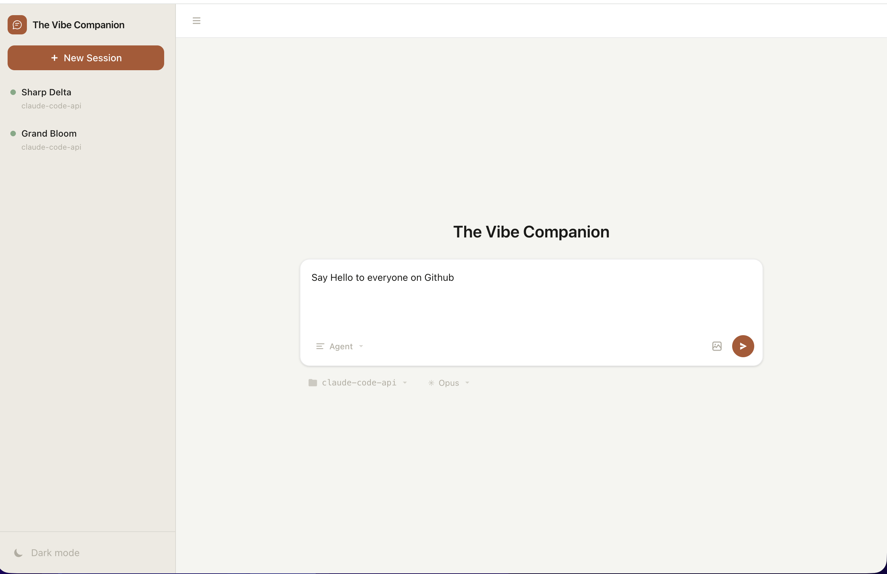

# The Companion

**Web UI for Claude Code and Codex sessions.**
Run multiple agents, inspect every tool call, and gate risky actions with explicit approvals.

[](https://www.npmjs.com/package/iclaude) [](https://www.npmjs.com/package/the-companion) [](LICENSE)

## Quick start

**Requirements:** [Bun](https://bun.sh) + [Claude Code](https://docs.anthropic.com/en/docs/claude-code) and/or [Codex](https://github.com/openai/codex) CLI.

### Try it instantly

```bash
bunx iclaude
```

Open [localhost:3456](http://localhost:3456). If you want to use the UI from outside, you can go to the settings and enable a tunnel, this will create a publicly visible cloudflared URL protected with authentication which you can scan with your iPhone .

## Why this is useful
- **Remote control**: Work from anywhere!
- **Session recovery**: Unlike the official remote, we can work with any session!
- **Parallel sessions**: work on multiple tasks without juggling terminals.
- **Full visibility**: see streaming output, tool calls, and tool results in one timeline.
- **Permission control**: approve/deny sensitive operations from the UI.
- **Dual-engine support**: designed for both Claude Code and Codex-backed flows.

## Screenshots
| Chat + tool timeline | Permission flow |
|---|---|
|  |  |

## Architecture (simple)
```text
Browser (React)
  <-> ws://localhost:3456/ws/browser/:session
Companion server (Bun + Hono)
  <-> ws://localhost:3456/ws/cli/:session
Claude Code / Codex CLI
```

The bridge uses the CLI `--sdk-url` websocket path and NDJSON events.

## Authentication

Automatically handled in the settings.

## Development
```bash
make dev
```

Manual:
```bash
cd web
bun install
bun run dev       # backend on :3456 + Vite HMR on :2345
```

The dev server runs two ports: backend API/WebSocket on `:3456`, frontend with HMR on `:2345`.

Production: `bun run build && bun run start` serves frontend + backend on a single port (`:3456`).

Checks:
```bash
cd web
bun run typecheck
bun run test
```

## Companion extensions

This project is 500 commits ahead of the original goat [companion](https://github.com/The-Vibe-Company/companion) 

This fork adds several features and UX improvements on top of the upstream Companion:

### Resuming
Freely switch between our user interface and the native Claude Code app. All sessions are completely synchronized. 

### Image serving route
`/api/images/*` route with tilde expansion for serving local images (used for iMessage integration too).

### Inline HTML fragments
Output HTML in a ` ```html ` code block and it auto-renders as an interactive iframe in the chat. Fragments can push state back to the agent via `window.vibeReportState()` and the agent can query it via REST. In YOLO mode you can control your computer with HTML elements.

### Built-in tunnel manager
One-click toggle in Settings to expose the server over an SSH tunnel (`companion.pannous.com`). Auto-injects auth tokens so remote access is seamless. Used in iOS native companion [app](https://github.com/pannous/Listen).

### AI-powered input completion

### Session forking
Fork button in the Composer creates a new independent session seeded with the current conversation history.

### Slash command
Root-level scripts (`.claude/commands/*.md`, project scripts) are auto-discovered and surfaced as slash commands in the HomePage and Composer menu. Global prompts from `~/.claude/prompts/*.md` are also available.

### Built-in code editor pane
`SessionEditorPane` — an in-browser file editor tab with syntax highlighting, file size gates for large files, and the ability to open files directly from chat by clicking paths.

### Per-project session grouping
Sidebar groups sessions by project folder. Clicking a folder label opens a new session in that folder. Per-project resume dropdown lets you quickly resume recent sessions.

### Ghost session filter
Sidebar filters out "ghost" sessions — those with no title, no history, and no meaningful state. Upstream shows everything.

### Clickable paths and URLs
Inline-code URLs in chat are clickable. Bare filenames are searched in the project directory and linked if found.

### Message queue management
Send-now button to bypass the pending-input queue. Cancel queued messages before they reach the CLI. Clear-input event support.

### Scroll behavior
Auto-scroll disables when the scroll-to-bottom button is visible. Clicking the TopBar session tab scrolls to top.

### iOS/iPad improvements
Text selection enabled in shell output. Copy icons and hundreds of quality of life improvements .

### Siri Shortcuts / Apple Watch API
`/api/ask` endpoint for sending prompts via Siri Shortcuts or Apple Watch.

### OpenRouter / AI provider toggle
Settings toggle between OpenRouter and direct Claude API for features like auto-naming and completion.

## Docs
- **Full documentation**: [`docs/`](docs/) (Mintlify — run `cd docs && mint dev` to preview locally)
- Protocol reverse engineering: [`WEBSOCKET_PROTOCOL_REVERSED.md`](WEBSOCKET_PROTOCOL_REVERSED.md)
- Contributor and architecture guide: [`CLAUDE.md`](CLAUDE.md)

## iOS native
check out the [Listen](https://github.com/pannous/Listen)  app for an iOS native client!

## License
MIT
